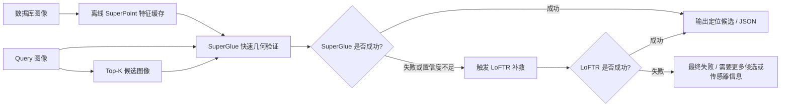

# 自适应室内图像匹配大作业

核心思想是：不要简单宣称 LoFTR 全面优于 SuperGlue，而是通过实验发现二者各自适用场景，然后设计一个自适应系统：

- 简单样本：优先使用 SuperGlue，速度快。
- 困难样本：SuperGlue 失败或置信度不足时，再调用 LoFTR 补救。
- 工程优化：数据库图像的 SuperPoint 特征可以离线缓存，减少在线重复计算。

## 1. 当前文件夹结构说明

根目录现在保留的是项目入口文件和几个清晰分类目录：

```text
CV/
├─ datasets/                         # 数据集、配对文件、传统 baseline 相关内容
├─ methods/                          # SuperGlue / LoFTR 方法代码和权重
├─ results/                          # 所有实验结果、原始结果表、Demo 可视化输出
├─ docs/                             # 正式项目说明文档
├─ materials/                        # 旧作业材料、参考文献等辅助材料
├─ adaptive_cascade_inloc.py          # 自适应策略主实验脚本
├─ adaptive_feature_cache.py          # SuperPoint 特征缓存工具
├─ offline_build_inloc_feature_cache.py
├─ online_localize_inloc_query.py
├─ adaptive_inloc_demo_app.py         # Streamlit Demo
├─ build_demo_feature_cache.ps1       # 一键构建 Demo 缓存
├─ run_online_query_demo.ps1          # 一键运行在线 query 示例
├─ run_adaptive_demo.ps1              # 一键启动 Demo
├─ README.md                          # GitHub 首页说明
└─ .gitignore                         # Git 忽略规则
```

### 1.1 `datasets/`

`datasets/` 放和数据集、配对文件、传统 baseline 有关的东西。

| 路径 | 作用 |
|---|---|
| `datasets/data/` | 原始数据图像，包括 HPatches 和 InLoc。 |
| `datasets/data/hpatches-sequences-release/` | HPatches 图像序列。 |
| `datasets/data/InLoc/` | InLoc 室内定位数据，包括 query 图像和数据库 cutout 图像。 |
| `datasets/baseline/` | ORB/SIFT baseline、配对生成脚本、标准化结果。 |
| `datasets/baseline/standardized_20260525/pairs/` | 统一配对 CSV，后续所有方法都基于这些配对比较。 |
| `datasets/baseline/standardized_20260525/pairs/pairs_hpatches.csv` | HPatches 标准图像对。 |
| `datasets/baseline/standardized_20260525/pairs/pairs_inloc_netvlad40.csv` | InLoc NetVLAD Top-40 候选图像对。 |
| `datasets/baseline/standardized_20260525/results/` | ORB/SIFT 在 HPatches 和 InLoc 上的结果。 |

### 1.2 `methods/`

`methods/` 放方法代码和模型权重。

| 路径 | 作用 |
|---|---|
| `methods/superglue/` | SuperPoint + SuperGlue 官方/改造代码。 |
| `methods/superglue/superglue_benchmark_lib.py` | 统一图像读取、SuperGlue 推理、RANSAC 几何验证、可视化等工具。 |
| `methods/superglue/benchmark_superglue.py` | SuperGlue 批量实验脚本。 |
| `methods/superglue/models/` | SuperPoint 和 SuperGlue 模型代码。 |
| `methods/loftr/` | LoFTR 同学给的实验脚本。 |
| `methods/loftr/hpatches-loftr(1).py` | LoFTR 在 HPatches 上的实验脚本。 |
| `methods/loftr/Inloc-Loftr(1).py` | LoFTR 在 InLoc 上的实验脚本。 |
| `methods/loftr_ckpt/` | LoFTR indoor/outdoor 权重文件备份。 |

### 1.3 `results/`

`results/` 放所有结果。

| 路径 | 作用 |
|---|---|
| `results/adaptive_cascade_results/` | 自适应 SuperGlue -> LoFTR 策略结果。 |
| `results/adaptive_cascade_results/adaptive_strategy_summary_with_policy.csv` | 最重要的总表，包含所有自适应策略的成功率、耗时、LoFTR 调用率。 |
| `results/adaptive_cascade_results/*/adaptive_query_results.csv` | 每个 query 的最终结果。 |
| `results/adaptive_cascade_results/*/adaptive_attempts.csv` | 每次候选匹配尝试的详细记录。 |
| `results/adaptive_cascade_results/*/adaptive_summary.json` | 单个策略的汇总 JSON。 |
| `results/adaptive_demo_outputs/` | Demo 案例图，包括 SuperGlue 成功、LoFTR 补救、最终失败。 |
| `results/raw_loftr/` | LoFTR 原始实验结果和可视化。 |
| `results/raw_superglue/` | SuperGlue 原始实验结果表。 |
| `results/adaptive_feature_cache/` | 离线特征缓存，运行 `build_demo_feature_cache.ps1` 后生成。 |
| `results/adaptive_online_outputs/` | 在线 query 示例输出，运行 `run_online_query_demo.ps1` 后生成。 |

### 1.4 `docs/`

`docs/` 现在只保留正式项目说明。

| 路径 | 作用 |
|---|---|
| `docs/PROJECT_GUIDE.md` | 当前这份总说明，合并了流程、结果、案例、局限性、报告提纲和文件解释。 |

### 1.5 `materials/`

`materials/` 放辅助材料，不是正式交付主体。

| 路径 | 作用 |
|---|---|
| `materials/course_materials/` | 旧分工、旧思路、作业说明、早期实验记录。 |
| `materials/references/` | 相关论文和参考资料。 |

### 1.6 根目录核心脚本

| 文件 | 作用 |
|---|---|
| `adaptive_cascade_inloc.py` | 自适应策略主实验脚本。它会读取 InLoc Top-40 候选，先跑 SuperGlue，再按策略触发 LoFTR。 |
| `adaptive_feature_cache.py` | SuperPoint 特征缓存工具，负责保存、读取、索引数据库图像特征。 |
| `offline_build_inloc_feature_cache.py` | 离线建库脚本，对数据库候选图像提前提取 SuperPoint 特征。 |
| `online_localize_inloc_query.py` | 在线单 query 查询脚本，模拟真实系统输入一张 query 后输出定位候选结果。 |
| `adaptive_inloc_demo_app.py` | Streamlit 可视化 Demo，展示策略总览、案例回放、现场运行和工程接口。 |
| `build_demo_feature_cache.ps1` | 一键构建 `IMG_0994` 示例 query 的数据库特征缓存。 |
| `run_online_query_demo.ps1` | 一键运行 `IMG_0994` 在线 query 示例。 |
| `run_adaptive_demo.ps1` | 一键启动 Streamlit Demo。 |
| `README.md` | GitHub 首页说明。 |
| `.gitignore` | 防止把数据集、权重、缓存、大型原始结果误传到 GitHub。 |

## 2. 从浅到深：本作业做了什么

### 阶段 1：整理数据集和评价任务

这一阶段解决的是：用什么数据评测、怎么构造图像对、用什么指标判断成功。

| 内容 | 代码 / 文件 | 产出 |
|---|---|---|
| 整理 HPatches 图像对 | `datasets/baseline/standardized_20260525/generate_pairs.py` | `pairs_hpatches.csv` |
| 整理 InLoc 图像对 | `datasets/baseline/standardized_20260525/pairs/pairs_inloc_netvlad40.csv` | InLoc NetVLAD Top-40 候选对 |
| 统一评价指标 | RANSAC 单应性、内点数、重投影误差、成功率、耗时 | 所有方法可公平对比 |

### 阶段 2：跑 ORB、SIFT、SuperGlue、LoFTR 基础对比

| 方法 | 代码位置 | 结果位置 |
|---|---|---|
| ORB / SIFT | `datasets/baseline/standardized_20260525/run_orb_sift.py` | `datasets/baseline/standardized_20260525/results/` |
| SuperGlue | `methods/superglue/` | `results/raw_superglue/` |
| LoFTR | `methods/loftr/` | `results/raw_loftr/` |

### 阶段 3：从单对匹配扩展到 Query-Level 定位

真实室内定位不是只匹配一对图，而是：

1. 输入一张 query 图像。
2. 检索得到 Top-K 候选数据库图像。
3. 对候选图像逐个做几何验证。
4. 只要某个候选验证成功，就认为 query 定位成功。

这一阶段得到一个关键结论：

> LoFTR 不是所有地方都赢。SuperGlue 更快，在前排候选里表现很好；LoFTR 在困难样本和靠后候选中补救能力更强。

因此，项目从“证明 LoFTR 更强”调整为更合理的方向：

> 设计一个自适应系统，让 SuperGlue 处理简单样本，让 LoFTR 只处理困难样本。

### 阶段 4：提出自适应 SuperGlue -> LoFTR 策略

核心流程：



### 阶段 5：工程化优化

工程化部分包括：

- 数据库图像 SuperPoint 特征离线缓存。
- 在线只处理 query 图像和候选验证。
- 输出 JSON 和 CSV，方便后续定位或建图模块读取。
- Streamlit Demo 展示系统流程和案例。

## 3. 主要结果表格

### 3.1 HPatches 配准结果

| 方法 | 配对数 | 成功数 | 成功率 | 平均匹配数 | 平均内点数 | 内点率 | 重投影误差 | 单对耗时 |
|---|---:|---:|---:|---:|---:|---:|---:|---:|
| ORB | 575 | 553 | 96.17% | 480.10 | 369.85 | 0.636 | 0.792 | 23.84 ms |
| SIFT | 575 | 556 | 96.70% | 354.49 | 324.08 | 0.827 | 0.432 | 75.92 ms |
| SuperGlue | 575 | 571 | 99.30% | 486.55 | 457.65 | 0.923 | 1.02 | 34.65 ms |
| LoFTR | 575 | 566 | 98.43% | 955.42 | 925.26 | 0.943 | 0.495 | 2844.80 ms |

结论：HPatches 中 SuperGlue 和 LoFTR 都表现较好，但 LoFTR 耗时明显高。

### 3.2 InLoc 单对几何验证结果

| 方法 | 配对数 | 成功数 | 成功率 | 平均匹配数 | 平均内点数 | 内点率 | 重投影误差 | 单对耗时 |
|---|---:|---:|---:|---:|---:|---:|---:|---:|
| ORB | 14235 | 1446 | 10.16% | 113.82 | 10.71 | 0.090 | 0.753 | 54.35 ms |
| SIFT | 14235 | 1128 | 7.92% | 28.45 | 8.25 | 0.302 | 0.669 | 92.61 ms |
| SuperGlue | 14235 | 2259 | 15.87% | 31.29 | 8.82 | 0.195 | 0.873 | 30.83 ms |
| LoFTR | 14235 | 2277 | 16.00% | 63.78 | 13.36 | 0.183 | 3.322 | 1999.15 ms |

结论：InLoc 更困难，单对成功率整体较低。LoFTR 成功数略高，但耗时远高于 SuperGlue。

### 3.3 InLoc Query-Level Top-K 成功率

| 方法 | Top1 | Top5 | Top10 | Top20 | Top40 |
|---|---:|---:|---:|---:|---:|
| ORB | 35.67% | 55.06% | 67.70% | 76.40% | 82.58% |
| SIFT | 28.93% | 40.73% | 46.63% | 52.25% | 60.11% |
| SuperGlue | 57.02% | 78.37% | 83.71% | 88.48% | 90.17% |
| LoFTR | 51.69% | 75.56% | 83.43% | 88.76% | 93.26% |

结论：SuperGlue 在前排候选上强且快，LoFTR 在 Top40 下最终成功率更高，说明它适合作为困难样本补救方法。

### 3.4 自适应策略结果

| 策略 | 成功数 | Query 数 | 成功率 | 平均在线耗时 | LoFTR 调用率 |
|---|---:|---:|---:|---:|---:|
| SuperGlue only | 320 | 356 | 89.89% | 365.87 ms | 0% |
| SuperGlue only + cache | 320 | 356 | 89.89% | 230.84 ms | 0% |
| LoFTR only | 334 | 356 | 93.82% | 675.83 ms | 100% |
| SG Top5 -> LoFTR + cache | 342 | 356 | 96.07% | 448.96 ms | 22.19% |
| SG Top10 -> LoFTR + cache | 344 | 356 | 96.63% | 430.31 ms | 17.42% |
| SG Top20 -> LoFTR + cache | 346 | 356 | 97.19% | 374.57 ms | 11.80% |
| SG Top40 -> LoFTR + cache | 347 | 356 | 97.47% | 406.78 ms | 10.11% |
| Confidence dispatch + cache | 336 | 356 | 94.38% | 267.97 ms | 37.92% |
| Confidence dispatch max10 + cache | 336 | 356 | 94.38% | 267.24 ms | 37.92% |
| Confidence then fixed + cache | 347 | 356 | 97.47% | 420.48 ms | 38.20% |
| Confidence then fixed strict + cache | 347 | 356 | 97.47% | 406.04 ms | 38.20% |

主推策略：

> `SG Top20 -> LoFTR + cache`。它成功率达到 97.19%，平均在线耗时 374.57 ms，LoFTR 调用率只有 11.80%，是成功率和效率之间最均衡的方案。

### 3.5 推荐三种运行模式

| 模式 | 策略 | 成功率 | 平均在线耗时 | 适合目标 |
|---|---|---:|---:|---|
| 快速模式 | Confidence dispatch + cache | 94.38% | 267.97 ms | 更低延迟，允许少量成功率下降 |
| 均衡模式 | SG Top20 -> LoFTR + cache | 97.19% | 374.57 ms | 成功率、耗时和 LoFTR 调用率最均衡 |
| 高精度模式 | Confidence then fixed strict + cache | 97.47% | 406.04 ms | 优先追求最高成功率 |

## 4. 三类案例图

| 案例类型 | 图片 | 说明 |
|---|---|---|
| SuperGlue 直接成功 | `results/adaptive_demo_outputs/IMG_0964_JPG_rank01_superglue.png` | 简单样本，SuperGlue 已经足够，不需要 LoFTR。 |
| LoFTR 补救成功 | `results/adaptive_demo_outputs/IMG_0994_JPG_rank01_loftr.png` | SuperGlue 失败后，LoFTR 补救成功，体现自适应策略价值。 |
| 最终失败 | `results/adaptive_demo_outputs/IMG_1053_JPG_rank03_loftr.png` | 即使 LoFTR 也失败，说明系统有边界，不能过度吹嘘。 |

## 5. 如何运行

### 5.1 启动 Demo

```powershell
.\run_adaptive_demo.ps1
```

浏览器打开：

```text
http://127.0.0.1:8501
```

### 5.2 构建 Demo 特征缓存

```powershell
.\build_demo_feature_cache.ps1
```

输出目录：

```text
results/adaptive_feature_cache/demo_img0994_top20/
```

### 5.3 运行在线 query 示例

```powershell
.\run_online_query_demo.ps1
```

输出目录：

```text
results/adaptive_online_outputs/demo_img0994/
```

输出包含：

- 最终是否成功。
- 使用 SuperGlue 还是 LoFTR 成功。
- 成功候选 rank。
- 内点数。
- 重投影误差。
- 在线耗时。

## 6. 局限性

需要在报告里客观说明这些点：

1. 系统不是完整 3D 重建系统，只是视觉定位或三维建图前端中的图像匹配与几何验证模块。
2. 当前实验主要基于 HPatches 和 InLoc，不能直接代表所有真实场景。
3. LoFTR 虽然在困难样本中有补救能力，但耗时仍高，不适合无条件全量调用。
4. 当前自适应策略主要基于规则和阈值，没有训练一个新的调度网络。
5. InLoc 部分使用的是候选检索后的几何验证，最终 pose 估计和完整地图优化不在本项目范围内。

## 7. 报告建议结构（只是建议，论文一定好好写！！）

建议报告按下面结构写：

1. 引言
   - 室内视觉定位和三维建图前端需要稳定图像匹配。
   - 传统方法在困难室内场景中不够稳定。
   - 深度匹配方法更强，但计算代价不同。

2. 相关方法
   - ORB / SIFT
   - SuperPoint + SuperGlue
   - LoFTR
   - 稀疏匹配与稠密匹配的区别

3. 数据集与评价指标
   - HPatches
   - InLoc
   - 匹配数、内点数、内点率、重投影误差、成功率、耗时

4. 基础实验对比
   - HPatches 结果
   - InLoc 单对结果
   - Query-Level Top-K 结果
   - 得出 LoFTR 并非全局最优，而是困难场景有优势

5. 自适应匹配系统设计
   - 系统流程图
   - SuperGlue 快速验证
   - LoFTR 困难样本补救
   - 数据库 SuperPoint 特征缓存
   - 快速、均衡、高精度三种模式

6. 实验结果与消融分析
   - SuperGlue only
   - LoFTR only
   - SG Top5/10/20/40 -> LoFTR
   - confidence dispatch
   - cache 前后对比

7. Demo 与工程应用
   - 离线建库
   - 在线 query
   - JSON 输出
   - 三类案例图

8. 局限性与未来工作
   - 当前不是完整定位系统
   - LoFTR 仍然较慢
   - 可进一步学习化调度策略

9. 结论
   - 本项目验证了稀疏与稠密匹配互补。
   - 自适应策略比单独使用 SuperGlue 或 LoFTR 更适合室内视觉定位前端。

## 8. 最终一句话总结

本作业不是简单比较 LoFTR 和 SuperGlue，而是面向室内视觉定位任务，分析稀疏匹配和稠密匹配的优劣，进一步设计了一个 SuperGlue 快速验证、LoFTR 困难样本补救、SuperPoint 特征缓存加速的自适应图像匹配系统，并通过 InLoc 实验、策略消融、在线查询 Demo 和案例可视化验证其工程价值。

